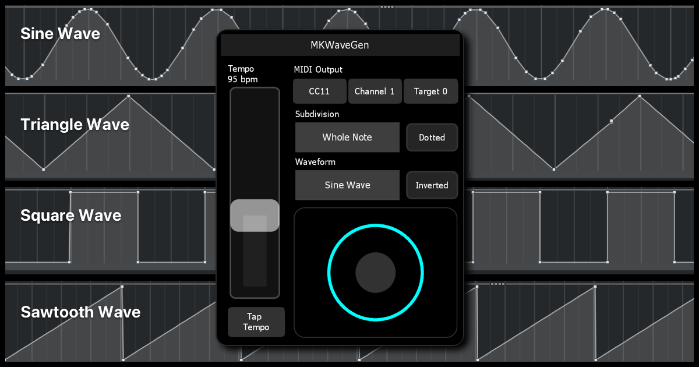

# MKWaveGen

Continuous Wave Generator

## Installation

1. Click the green "Code" button at the top of this page and download the zip files.
2. Drag and drop MKWaveGen.jzlib or MKWaveGenMini.jzlib into one of your Lemur projects to start using it right away.
3. You can also double-click the **MKWaveGenDemo.jzml** file to see a demo of how it works.

## Feedback and Support

We welcome your suggestions for improvements and reports of any bugs you encounter. Here's how you can get in touch:

### Suggest Improvements or Report Bugs

1. **Go to the Issues Tab**: Click on the "Issues" tab at the top of this page.
2. **New Issue**: Click the "New Issue" button.
3. **Provide Details**: Describe your suggestion or the problem you encountered. Please include as much detail as possible to help us understand and address your feedback.
